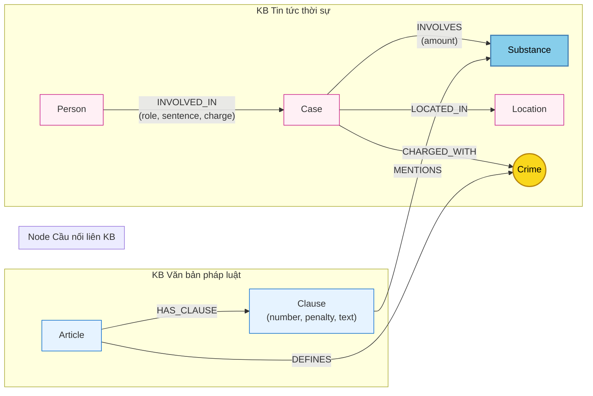

# Thiết kế Ontology — Day 19

**Họ tên:** Mai Hoàng Anh  **MSSV:** 2A202602857

**Lựa chọn** (đánh dấu một):
- [x] Dùng ontology gợi ý (có thể chỉnh nhỏ)
- [ ] Tự thiết kế (xét bonus +15, xem `SUBMISSION.md`)

> Hướng dẫn: `LAB_GUIDE.md` Bước 2. Dùng ontology gợi ý thì vẫn phải điền đủ các mục dưới đây bằng lời của bạn.

---

## 1. Sơ đồ

Sơ đồ biểu diễn Ontology 2 cơ sở tri thức (Pháp luật ma túy & Tin tức ma túy). Trong đó, **`Crime`** là **node cầu nối chính** và **`Substance`** là **node cầu nối phụ**.

---

## 2. Entity types (node labels)

| Label | Ý nghĩa | Khóa định danh (`MERGE` theo) | Properties | Lấy từ KB nào | Trích bằng (regex / LLM / khác) |
| --- | --- | --- | --- | --- | --- |
| **`Article`** | Điều luật trong văn bản quy phạm pháp luật (BLHS hoặc Luật PCMT) | `id` (ví dụ: `"Điều 251 BLHS"`) | `id`, `title`, `law`, `doc_id` | KB Luật | Regex (từ YAML frontmatter & markdown header) |
| **`Clause`** | Khoản luật quy định tình tiết định khung và hình phạt | `id` (ví dụ: `"Điều 251 BLHS khoản 1"`) | `id`, `number`, `penalty`, `text`, `doc_id` | KB Luật | Regex (nhận diện `^(\d+)\.\s` và trích xuất `penalty`) |
| **`Crime`** | Tội danh chuẩn hóa (node cầu nối giữa luật và hành vi trong thực tế) | `name` (tên tội viết thường, lược bỏ từ `"tội"`) | `name` | Cả hai | Regex (từ tiêu đề Điều luật) + LLM & hàm `link_entity` (tin tức) |
| **`Substance`** | Tên chất ma túy hoặc tiền chất | `name` (tên chất chuẩn hóa theo danh mục) | `name` | Cả hai | Lookup regex chuỗi con `SUBSTANCES` (luật) + LLM & danh sách chuẩn (tin) |
| **`Case`** | Vụ án / vụ việc phạm pháp được báo chí phản ánh | `name` (tên định danh ngắn của vụ án) | `name`, `summary`, `date`, `doc_id`, `source_title` | KB Tin tức | LLM (`NEWS_EXTRACTION_PROMPT`) |
| **`Person`** | Cá nhân liên quan (bị can, bị cáo, nghi phạm, người có nghĩa vụ) | `name` (họ tên đầy đủ của cá nhân) | `name`, `aliases` (danh sách biệt danh) | KB Tin tức | LLM (`NEWS_EXTRACTION_PROMPT`) |
| **`Location`** | Địa bàn tỉnh/thành phố nơi diễn ra hành vi hoặc nơi xét xử | `name` (tên địa phương) | `name` | KB Tin tức | LLM (`NEWS_EXTRACTION_PROMPT`) |

---

## 3. Relationships

| Type | Từ → Đến | Properties trên cạnh | Ý nghĩa |
| --- | --- | --- | --- |
| **`DEFINES`** | `Article` → `Crime` | *(không có)* | Điều luật quy định định danh tội phạm tương ứng. |
| **`HAS_CLAUSE`** | `Article` → `Clause` | *(không có)* | Điều luật bao gồm các khoản quy định chi tiết về hành vi và khung hình phạt. |
| **`MENTIONS`** | `Clause` → `Substance` | *(không có)* | Khoản luật đề cập cụ thể đến loại chất ma túy hoặc tiền chất làm căn cứ định khung. |
| **`INVOLVED_IN`** | `Person` → `Case` | `role`, `sentence`, `charge` | Cá nhân tham gia vụ án với vai trò cụ thể (`role`), bị truy tố/kết án tội danh (`charge`) và mức án (`sentence`). |
| **`CHARGED_WITH`** | `Case` → `Crime` | *(không có)* | Vụ án có hành vi bị khởi tố/xét xử theo tội danh chuẩn hóa. |
| **`INVOLVES`** | `Case` → `Substance` | `amount` | Vụ án thu giữ hoặc liên quan đến loại chất ma túy cụ thể với khối lượng tang vật (`amount`). |
| **`LOCATED_IN`** | `Case` → `Location` | *(không có)* | Vụ việc xảy ra hoặc được Tòa án thụ lý xét xử tại địa phương tương ứng. |

---

## 4. Node cầu nối giữa 2 KB

- **Node nào:** 
  - **`Crime`** (Tội danh) là **node cầu nối chính**.
  - **`Substance`** (Chất ma túy) là **node cầu nối phụ**.
- **Vì sao chọn node này:**
  1. Báo chí tường thuật các vụ việc bằng tội danh và hành vi cụ thể (ví dụ: *"khởi tố về tội mua bán trái phép chất ma túy"*, *"bắt giữ vì hành vi tổ chức sử dụng trái phép chất ma túy"*), nhưng rất hiếm khi phóng viên ghi chính xác mã điều khoản luật hình sự (như *"khoản 2 Điều 251"*).
  2. Ngược lại, Bộ luật Hình sự phân định ranh giới tội phạm và chế tài thông qua từng Điều luật có tiêu đề tương ứng với tên tội danh.
  3. Do đó, việc dùng `Crime` làm cầu nối trung gian cho phép kết nối tự nhiên từ **Vụ án đời thực (`Case`) → Tội danh (`Crime`) → Điều luật (`Article`) → Khung hình phạt cụ thể (`Clause`)**.
  4. Ngoài ra, `Substance` là cầu nối bổ trợ quan trọng: loại chất ma túy tang vật trong tin tức khi giao thoa với loại chất quy định trong các Khoản luật giúp xác định chính xác khung hình phạt tương ứng khối lượng (điển hình như bài toán định khung tại Q5).
- **Cách đảm bảo hai phía khớp tên** (chuẩn hóa, `link_entity`, danh sách chuẩn trong prompt…):
  1. **Chuẩn hóa chuỗi (`normalize_crime`):** Chuyển về chữ thường, cắt bỏ dấu ngoặc kép, khoảng trắng thừa và tiền tố `"tội "`. Ví dụ: `"Tội Mua bán trái phép chất ma túy"` $\rightarrow$ `"mua bán trái phép chất ma túy"`.
  2. **Ràng buộc tên tội trong Prompt trích xuất:** Danh sách các tội danh chuẩn trích từ KB Luật (`known_crimes`) được truyền trực tiếp vào `NEWS_EXTRACTION_PROMPT` với chỉ dẫn bắt buộc LLM chỉ được chọn tên tội có sẵn trong danh sách.
  3. **Thuật toán liên kết thực thể (`link_entity`):** Tên tội hoặc tội danh cá nhân do LLM trích xuất được đưa qua hàm `link_entity`:
     - Bước 1: Chuẩn hóa cả 2 phía và so khớp chính xác (`exact match`).
     - Bước 2: Nếu chưa khớp, dùng thuật toán so khớp mờ `difflib.get_close_matches(cutoff=0.8)` để bắt các trường hợp viết tắt nhẹ hoặc lệch vài ký tự.
     - Trả về đúng tên chuẩn nguyên bản trong `known_crimes`.
  4. **Kiểm soát từ vựng chất ma túy:** Áp dụng danh sách chuẩn `SUBSTANCES = ["Heroine", "Cocaine", "Methamphetamine", "Amphetamine", "MDMA", "XLR-11", "Ketamine", "cần sa", "thuốc phiện", "côca"]` cho cả hai phía luật và tin tức.
- **Khi nào cầu gãy, và bạn xử lý thế nào:**
  - *Khi nào cầu gãy:*
    1. Bài báo sử dụng tiếng lóng / thuật ngữ dân dã thay vì tên tội danh pháp lý (ví dụ: *"đi bay phòng"*, *"chơi kẹo bay lắc"*, *"buôn hàng trắng"*).
    2. Tin tức nói về tội danh thuộc điều luật chưa có trong tập dữ liệu KB Luật (ngoài phạm vi Chương XX BLHS).
    3. LLM trích xuất sai tên tội danh thành chuỗi lạ nằm ngoài ngưỡng tương đồng 0.8 của `link_entity`.
  - *Cách xử lý khi cầu gãy:*
    1. Khi `link_entity` trả về `None`, hệ thống không tạo quan hệ sai vào graph nhằm tránh gán nhầm điều luật.
    2. Triển khai kiến trúc **Hybrid GraphRAG** (pha retrieval kết hợp cả Vector Search top-k text chunks và Graph Facts): nếu cầu nối trên graph bị đứt, các chunk văn bản liên quan tìm được qua vector similarity vẫn cung cấp đủ bối cảnh cần thiết để LLM trả lời câu hỏi, không để hệ thống bị "mù thông tin".

---

## 5. Competency questions

Với mỗi câu trong `data/benchmark_kg.json`, dưới đây là đường đi trên graph và truy vấn Cypher tương ứng:

| Câu | Đường đi (Cypher pattern) | Trả lời được? |
| --- | --- | --- |
| **Q1** (single-hop-law) | `(:Article {law: 'Luật PCMT'})-[:HAS_CLAUSE]->(:Clause)` Truy vấn: `MATCH (a:Article)-[:HAS_CLAUSE]->(cl:Clause) WHERE a.id CONTAINS 'Điều 2' AND cl.number = 4 RETURN cl.text` | **Có** |
| **Q2** (single-hop-news) | `(:Case)<-[:INVOLVED_IN {sentence: 'tử hình'}]-(:Person)` Truy vấn: `MATCH (p:Person)-[r:INVOLVED_IN]->(k:Case) WHERE (k.name CONTAINS '36kg' OR k.source_title CONTAINS '36kg') AND r.sentence CONTAINS 'tử hình' RETURN p.name, r.sentence` | **Có** |
| **Q3** (cross-kb) | `(:Person {name: 'Lê Minh Thành'})-[:INVOLVED_IN]->(:Case)-[:CHARGED_WITH]->(:Crime)<-[:DEFINES]-(:Article)-[:HAS_CLAUSE]->(:Clause {number: 1})` Truy vấn: `MATCH (p:Person {name: 'Lê Minh Thành'})-[r:INVOLVED_IN]->(k:Case)-[:CHARGED_WITH]->(c:Crime)<-[:DEFINES]-(a:Article)-[:HAS_CLAUSE]->(cl:Clause {number: 1}) RETURN p.name, r.sentence, c.name, a.id, cl.penalty` | **Có** |
| **Q4** (cross-kb) | `(:Person)-[:INVOLVED_IN]->(:Case)-[:CHARGED_WITH]->(:Crime)<-[:DEFINES]-(:Article)-[:HAS_CLAUSE]->(:Clause)` Truy vấn: `MATCH (p:Person)-[r:INVOLVED_IN]->(k:Case)-[:CHARGED_WITH]->(c:Crime)<-[:DEFINES]-(a:Article)-[:HAS_CLAUSE]->(cl:Clause) WHERE any(alias IN p.aliases WHERE alias CONTAINS 'Hoàng Nato') OR p.name CONTAINS 'Hoàng Nato' RETURN p.name, r.charge, a.id, cl.number, cl.penalty` | **Có** |
| **Q5** (cross-kb-multi-hop) | `(:Person {name: 'Cái Quang Huy'})-[:INVOLVED_IN]->(:Case)-[:INVOLVES]->(s:Substance {name: 'MDMA'})` song song với: `(Case)-[:CHARGED_WITH]->(Crime)<-[:DEFINES]-(Article)-[:HAS_CLAUSE]->(Clause)-[:MENTIONS]->(Substance)` Truy vấn: `MATCH (p:Person {name: 'Cái Quang Huy'})-[r:INVOLVED_IN]->(k:Case)-[inv:INVOLVES]->(s:Substance {name: 'MDMA'}) MATCH (k)-[:CHARGED_WITH]->(c:Crime)<-[:DEFINES]-(a:Article)-[:HAS_CLAUSE]->(cl:Clause)-[:MENTIONS]->(s) RETURN p.name, r.charge, s.name, inv.amount, a.id, cl.number, cl.penalty, cl.text` | **Có** *(Graph cung cấp Điều 250, tang vật 9,6kg MDMA và text các khoản; LLM đối chiếu 9,6kg > 100g để xác định Khoản 4)* |
| **Q6** (aggregation) | `(:Case)-[:INVOLVES]->(:Substance {name: 'MDMA'})` Truy vấn: `MATCH (k:Case)-[r:INVOLVES]->(s:Substance) WHERE toLower(s.name) = 'mdma' RETURN k.name, k.summary, r.amount` | **Có** |

---

## 6. Quyết định thiết kế và đánh đổi

### Quyết định 1: Chọn `Crime` làm node cầu nối trung gian thay vì nối trực tiếp `Case → Article`
- **Đã chọn:** `(Case)-[:CHARGED_WITH]->(Crime)<-[:DEFINES]-(Article)`.
- **Phương án khác:** Nối trực tiếp `(Case)-[:VIOLATES]->(Article)`.
- **Vì sao chọn:** Báo chí hiếm khi trích dẫn chính xác mã số điều luật (ví dụ: *"theo Điều 251 BLHS"*), mà hầu như luôn sử dụng tên gọi tội danh (ví dụ: *"về tội mua bán trái phép chất ma túy"*). Nếu yêu cầu LLM dự đoán trực tiếp mã điều luật, tỷ lệ ảo giác (hallucination) và gán sai điều luật rất cao. Việc tách `Crime` thành một thực thể chuẩn hóa giúp tận dụng năng lực phân loại ngôn ngữ tự nhiên của LLM, sau đó dùng deterministic linking (`link_entity`) để kết nối chính xác vào cây điều luật.

### Quyết định 2: Mô hình hóa cấu trúc luật tới cấp độ Khoản (`Clause`) thay vì chỉ dừng ở Điều (`Article`) hoặc tách sâu tới Điểm (`Point`)
- **Đã chọn:** Tách văn bản luật thành `Article` và `Clause` (`Article -[:HAS_CLAUSE]-> Clause`).
- **Phương án khác:** 
  1. Chỉ dừng ở node `Article` (lưu toàn bộ nội dung điều luật trong một thuộc tính).
  2. Tách sâu xuống từng Điểm (`Article → Clause → Point`).
- **Vì sao chọn:** 
  - Nếu chỉ dừng ở `Article`, graph không thể trả lời các câu hỏi yêu cầu khung hình phạt cơ bản (Khoản 1) hoặc khung tăng nặng cụ thể (Khoản 2, 3, 4) như Q3, Q4, Q5 mà phải nhồi toàn bộ nội dung điều luật vào context, làm bùng nổ token.
  - Nếu tách sâu tới cấp `Point`, cấu trúc luật trở nên quá phức tạp, sinh ra số lượng node quá lớn, khó trích xuất tự động bằng regex một cách ổn định. Cấp `Clause` là điểm cân bằng tối ưu giữa độ mịn thông tin và tính khả thi trong xử lý chuỗi.

### Quyết định 3: Lưu mức án (`sentence`), vai trò (`role`) và tội danh riêng (`charge`) làm property trên cạnh `INVOLVED_IN`
- **Đã chọn:** `(Person)-[:INVOLVED_IN {role, sentence, charge}]->(Case)`.
- **Phương án khác:** Tạo các node thực thể riêng biệt như `Sentence` (ví dụ: `Node("tử hình")`, `Node("36 tháng tù")`) hoặc `Role` (`Node("bị cáo")`).
- **Vì sao chọn:** Mức án và vai trò là thông tin phụ thuộc theo ngữ cảnh của một cá nhân trong một vụ án cụ thể (một người có thể là bị cáo trong vụ án này nhưng là nhân chứng trong vụ án khác). Nếu biến chúng thành node, các node phổ biến như `Sentence {name: "tử hình"}` hoặc `Sentence {name: "2 năm tù"}` sẽ trở thành các "super-nodes" (nút có bậc cực lớn kết nối với hàng chục vụ án), gây chậm truy vấn đường đi ngắn nhất và tạo nhiễu khi lan truyền thông tin trong GraphRAG.

---

## 7. So với ontology gợi ý (bắt buộc nếu xét bonus)

| Điểm khác | Gợi ý làm gì | Bạn làm gì | Vấn đề nó giải quyết | Bằng chứng (Cypher, hoặc số liệu benchmark) |
| --- | --- | --- | --- | --- |
| *Không áp dụng* | Sử dụng ontology gợi ý chuẩn với Crime làm cầu nối | Áp dụng đúng ontology gợi ý có sẵn trong `src/graph.py` | Đảm bảo tính tương thích tuyệt đối với các hàm test và script benchmark chuẩn | 41/41 test base đã pass; contract `link_entity`, `build_graph`, `context`, `answer` được đảm bảo chuẩn mực |

---

## 8. Hạn chế còn lại

1. **Khóa định danh phụ thuộc vào chuỗi văn bản do LLM sinh ra:**
   - Thuộc tính `Case.name` và `Person.name` do LLM tự đặt trong JSON. Nếu hai bài báo cùng đưa tin về một đối tượng nhưng một bài ghi đầy đủ *"Dương Minh Tuấn"*, bài kia chỉ ghi *"Hoàng Nato"*, hoặc một bài ghi *"Vụ mua bán 36kg ma túy tại TP.HCM"*, bài kia ghi *"Đường dây ma túy 36kg của Trần Thanh Tuấn"*, graph sẽ bị nhân bản thành hai node khác nhau (entity resolution chưa triệt để nếu thiếu trường CCCD / ID định danh duy nhất).
2. **Chưa có công cụ tính toán suy luận ngưỡng số học (Numerical Reasoning trên Graph):**
   - Các khoản tăng nặng trong Bộ luật Hình sự phân định dựa trên khoảng số học (ví dụ: từ 05g đến dưới 30g, từ 30g đến dưới 100g, từ 100g trở lên). Hiện tại graph chỉ lưu trữ dưới dạng text (`Clause.text`, `INVOLVES.amount = "hơn 9,6kg"`). Graph chưa có cơ chế tự so sánh toán học `9.600g > 100g` để tự động kích hoạt cạnh nối trực tiếp từ `Case` đến `Clause {number: 4}` mà vẫn phải nhờ LLM tổng hợp ở pha cuối.
3. **Chưa biểu diễn tiến trình thời gian và giai đoạn tố tụng:**
   - Một vụ án ma túy trải qua nhiều giai đoạn: Bắt giữ quả tang $\rightarrow$ Khởi tố điều tra $\rightarrow$ Truy tố $\rightarrow$ Xét xử sơ thẩm $\rightarrow$ Phúc thẩm. Ontology hiện tại coi `Case` là một thực thể tĩnh, chưa gắn nhãn thời gian hoặc trạng thái tố tụng cho từng quan hệ `INVOLVED_IN`.
